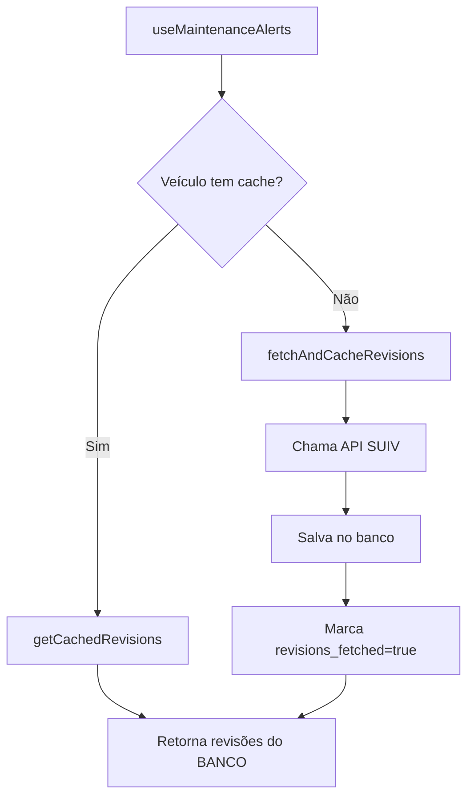

# 💰 Sistema de Cache de Revisões - Economia de API

## 🎯 Objetivo

**Reduzir custos da API SUIV ao MÁXIMO** através de cache inteligente de planos de revisão.

### Regra de Ouro:
> **1 requisição API por veículo. Nunca mais!**

---

## 📊 Como Funciona

### Cenário Tradicional (SEM cache):
```
Proprietário cadastra veículo → API chamada (1x)
Proprietário visualiza alertas → API chamada (2x)
Oficina vê o mesmo veículo → API chamada (3x)
Proprietário vê de novo → API chamada (4x)
...
```
**Resultado:** Múltiplas requisições para o mesmo veículo = $$$ 💸

### Cenário Atual (COM cache):
```
Proprietário cadastra veículo → API chamada (1x) + SALVA NO BANCO
Proprietário visualiza alertas → Lê do BANCO (0 API calls)
Oficina vê o mesmo veículo → Lê do BANCO (0 API calls)
Proprietário vê de novo → Lê do BANCO (0 API calls)
...
```
**Resultado:** Apenas 1 requisição + infinitas leituras grátis = 💰 Economia máxima!

---

## 🏗️ Arquitetura

### 1. Tabela no Banco de Dados
```sql
vehicle_manufacturer_revisions
- vehicle_id (referência ao veículo)
- category, item, description
- km_interval, time_interval
- min_cost, max_cost
- source (suiv/generic)
```

### 2. Flags de Controle no Veículo
```sql
vehicles.revisions_fetched (boolean)
vehicles.revisions_fetched_at (timestamp)
```

### 3. Serviço de Cache
`src/services/vehicleRevisionsCache.ts`

**Funções principais:**
- `getVehicleRevisions()` - Função principal (use esta!)
- `getCachedRevisions()` - Busca do banco
- `fetchAndCacheRevisions()` - Busca da API e salva
- `hasRevisionsCached()` - Verifica se já buscou

---

## 🔄 Fluxo de Dados



---

## ✅ Garantias do Sistema

### 1. Cache Compartilhado
- Proprietário cadastra veículo → Cache criado
- Oficina vê o mesmo veículo → Usa o MESMO cache
- Nenhuma duplicação de dados

### 2. Política RLS (Row Level Security)
```sql
-- Proprietários veem revisões dos seus veículos
CREATE POLICY "Users can view revisions for their vehicles"

-- Oficinas veem revisões de veículos que atendem
CREATE POLICY "Workshops can view revisions for client vehicles"
```

### 3. Logs de Economia
```typescript
console.log('[CACHE] Using 15 cached revisions for vehicle abc123')
console.log('[CACHE] 🚨 MAKING API CALL for vehicle xyz789 🚨')
```

---

## 📈 Exemplo de Economia

### Cenário Real:
- 100 veículos cadastrados
- 10 oficinas atendendo
- Cada veículo visualizado 50x/mês (proprietário + oficinas)

**Sem cache:**
```
100 veículos × 50 visualizações = 5.000 chamadas API/mês
```

**Com cache:**
```
100 veículos × 1 chamada inicial = 100 chamadas API/mês
Economia: 98% (4.900 chamadas economizadas!)
```

Se cada chamada custa R$ 0,10:
- Sem cache: R$ 500,00/mês
- Com cache: R$ 10,00/mês
- **Economia: R$ 490,00/mês** 💰

---

## 🚀 Como Usar

### Para Desenvolvedores

**Sempre use a função principal:**
```typescript
import { getVehicleRevisions } from '@/services/vehicleRevisionsCache';

const revisions = await getVehicleRevisions(
  vehicleId,
  brand,
  model,
  year
);
```

**Não use diretamente:**
```typescript
// ❌ NÃO FAÇA ISSO:
const revisions = await getManufacturerRevisions(brand, model, year);
```

### Para Administradores

**Verificar economia:**
```typescript
import { getCacheStats } from '@/services/vehicleRevisionsCache';

const stats = await getCacheStats();
console.log(stats);
// {
//   totalVehicles: 100,
//   vehiclesWithCache: 95,
//   totalRevisionsCached: 1425,
//   estimatedAPICallsSaved: ...
// }
```

**Limpar cache de um veículo (raro!):**
```typescript
import { clearVehicleCache } from '@/services/vehicleRevisionsCache';

await clearVehicleCache(vehicleId);
// Próxima consulta vai buscar da API novamente
```

---

## 🔮 Futuro: Atualização Anual

### Planejado (não implementado ainda):
```typescript
// Verificar se cache tem mais de 1 ano
if (yearsSince(vehicle.revisions_fetched_at) >= 1) {
  await clearVehicleCache(vehicleId);
  // Próxima consulta vai atualizar
}
```

---

## 📝 Checklist de Implementação

- [x] Tabela `vehicle_manufacturer_revisions` criada
- [x] Campos de controle em `vehicles` (revisions_fetched)
- [x] Serviço `vehicleRevisionsCache.ts` implementado
- [x] `useMaintenanceAlerts` usando cache
- [x] Logs de debug para tracking
- [x] RLS policies configuradas
- [ ] Dashboard de economia (futura melhoria)
- [ ] Atualização anual automática (futura melhoria)

---

## 🎓 Conceitos Importantes

### Cache-First Strategy
Sempre tenta buscar do cache primeiro. API é último recurso.

### Write-Through Cache
Quando busca da API, SEMPRE salva no banco imediatamente.

### Idempotência
Múltiplas chamadas retornam mesmo resultado. Seguro para retry.

### Fallback Gracioso
Se API falhar, marca como "fetched" para evitar loops infinitos.

---

## 🐛 Troubleshooting

**Problema:** Revisões não aparecem
```typescript
// Verificar se cache existe
const has = await hasRevisionsCached(vehicleId);
console.log('Has cache?', has);

// Verificar o cache
const cached = await getCachedRevisions(vehicleId);
console.log('Cached revisions:', cached.length);
```

**Problema:** API sendo chamada múltiplas vezes
```typescript
// Verificar logs no console
// Procure por: "[CACHE] 🚨 MAKING API CALL"
// Se aparecer múltiplas vezes para o mesmo veículo = BUG!
```

---

## 💡 Dicas de Performance

1. **Prefetch**: Ao cadastrar veículo, já busque revisões imediatamente
2. **Batch**: Se cadastrar vários veículos, busque em paralelo
3. **Monitor**: Adicione métricas para tracking de cache hit/miss

---

**Desenvolvido com ❤️ para reduzir custos e aumentar performance!**
